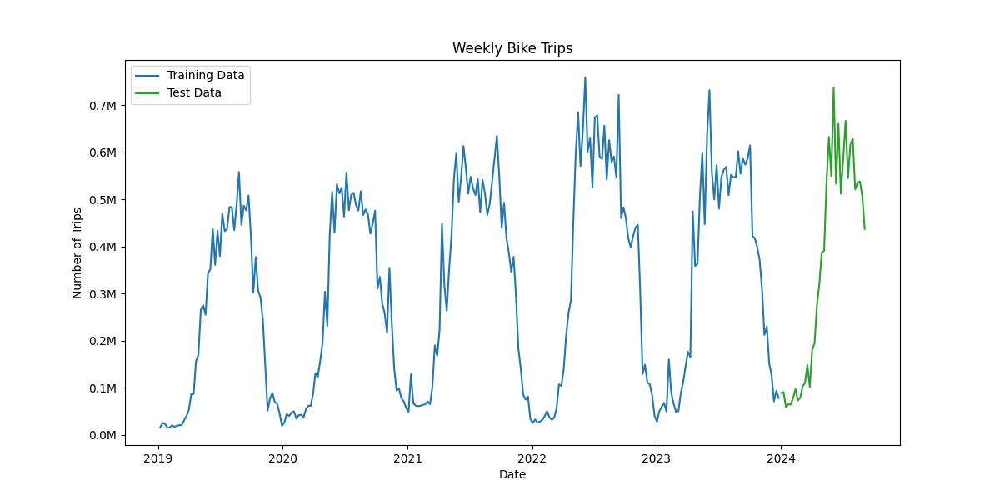
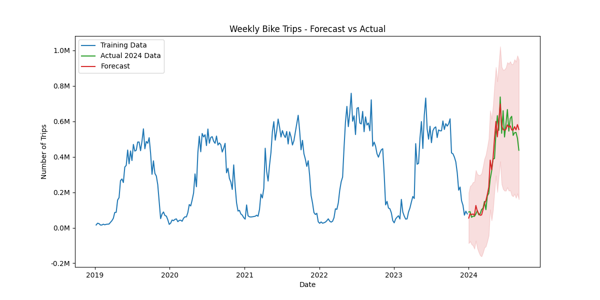
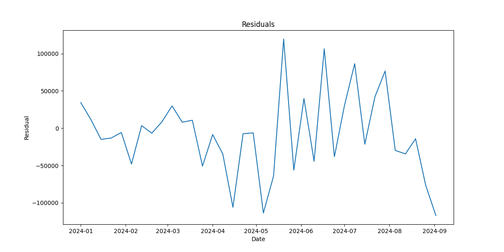
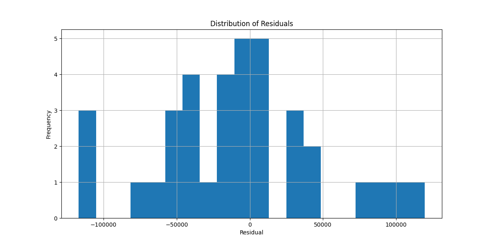

# Bike Trip Prediction Project

This project aims to predict bike trips in Montreal for 2024 based on historical data from 2019-2023. We've performed both monthly and weekly analyses to compare their effectiveness.

## Data Overview

The initial data consists of hourly bike trip counts from various counters across Montreal. This data was aggregated to both monthly and weekly totals for analysis. An attempt was also made to analyze daily data, but the results were inconclusive and are not included in this analysis.

## ARIMA Model and Predictions

An ARIMA (Autoregressive Integrated Moving Average) model was used for this time series forecasting task. The model was trained on data from 2019-2023 and used to predict bike trips for 2024. We performed both monthly and weekly predictions to compare their accuracy.

## Model Evaluation

The model's performance was evaluated using several metrics for both monthly and weekly predictions:

### Monthly Predictions:
- Mean Absolute Error (MAE): 115278.79150524423
- Root Mean Squared Error (RMSE): 149535.6046917907
- Mean Absolute Percentage Error (MAPE): 15.231320859145093%

### Weekly Predictions:
- Mean Absolute Error (MAE): 42244.414164010355
- Root Mean Squared Error (RMSE): 55190.78472044818
- Mean Absolute Percentage Error (MAPE): 15.42150897044962%

Additionally, we plotted the residuals (differences between predicted and actual values) to assess the model's performance visually.

## Comparison of Monthly and Weekly Predictions

The weekly prediction model shows similar performance to the monthly model in terms of percentage error (MAPE). The weekly MAPE (15.42%) is slightly higher than the monthly MAPE (15.23%), indicating that the granularity of weekly predictions didn't significantly improve the model's accuracy in terms of percentage error.

However, the absolute error metrics (MAE and RMSE) for the weekly model are lower than those for the monthly model. This is expected because weekly predictions deal with smaller numbers (weekly trip counts instead of monthly totals).

The similar MAPE values suggest that both models face comparable challenges in capturing the underlying patterns and external factors affecting bike trip numbers.

## Daily Analysis Attempt

An attempt was made to analyze and predict bike trips on a daily basis. However, the results were inconclusive and did not provide clear improvements over the weekly and monthly models. As a result, the daily analysis is not included in this analysis. This experience highlights the complexity of predicting bike trip patterns at very granular levels and suggests that factors beyond just historical patterns may play a significant role in daily fluctuations.

## Conclusion

Our ARIMA models, developed to predict bike trips in Montreal for 2024 based on historical data from 2019-2023, show moderate predictive power for both monthly and weekly aggregations, but with some notable deviations from actual values.

1. Model Performance:
   - The Mean Absolute Percentage Error (MAPE) of around 15% for both models indicates that, on average, our predictions deviate from the actual values by about 15%. This suggests a reasonable level of accuracy, but there's still room for improvement.
   - The weekly model provides more granular predictions but doesn't significantly improve the percentage accuracy over the monthly model.
   - The attempt at daily predictions yielded inconclusive results, suggesting that predicting at such a granular level may require more complex models or additional data sources.

2. Contextual Factors:
   - The winter pilot of BIXI from November 16, 2023, to April 14, 2024, likely introduced a significant change in the typical seasonal pattern of bike usage.
   - The addition of 1,300 new bikes and 32 new stations starting April 15, 2024, would have increased the capacity and accessibility of the bike-sharing system.
   - Continued improvements in Montreal's cycling infrastructure in 2024 could have encouraged more people to cycle.

3. Interpretation of Results:
   - The residuals plots for both models show that while they capture the overall trend, there are notable periods where they consistently over- or under-predict, particularly during periods of system change.
   - The distribution of residuals reveals that although most errors are centered around zero, there are significant outliers, particularly in periods where external factors influenced trip numbers in ways that the models could not foresee.

4. Limitations and Considerations:
   - The ARIMA models rely heavily on historical patterns and don't account for sudden changes in the system or external factors.
   - The relatively short prediction period (36 weeks for the weekly model) means we should be cautious about drawing long-term conclusions from these results.
   - The inconclusive results from the daily analysis suggest that more advanced modeling techniques or additional data sources might be necessary for accurate daily predictions.

While our models provide a useful baseline for predicting bike trips in Montreal, the introduction of winter service, system expansion, and continued infrastructure improvements have contributed to notable deviations from our predictions, as shown in the residuals analysis. This underscores the importance of regularly updating and re-training the models with the most recent data, and potentially incorporating external factors to improve accuracy.

Moving forward, addressing these external influences in the models could reduce prediction errors and provide more accurate forecasting tools for future usage trends. Additionally, exploring other modeling techniques or hybrid approaches might yield better results in capturing both the long-term trends and short-term fluctuations in bike trip patterns, especially when attempting to predict at more granular levels like daily usage.