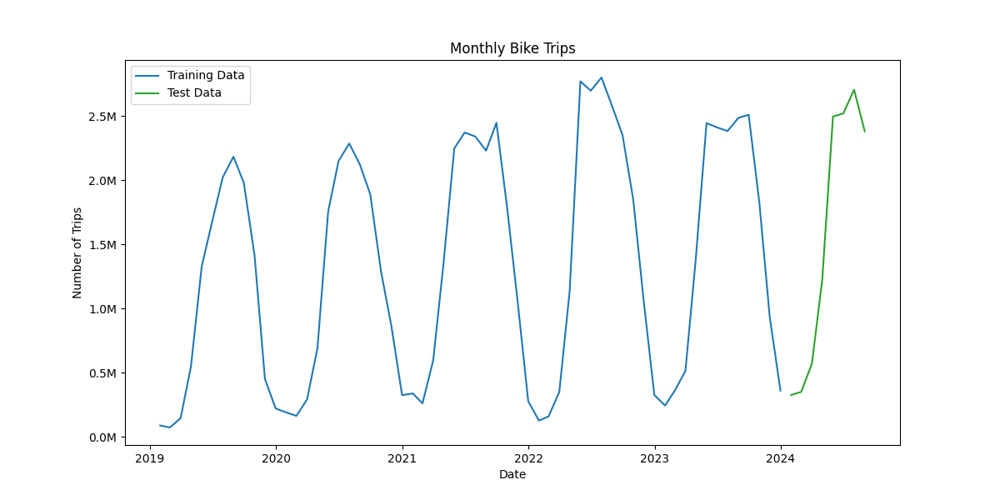

# Bike Trip Prediction Project

This project aims to predict monthly bike trips in Montreal for 2024 based on historical data from 2019-2023.

## Data Overview

The initial data consists of hourly bike trip counts from various counters across Montreal. This data was aggregated to monthly totals for analysis.

## ARIMA Model and Predictions

An ARIMA (Autoregressive Integrated Moving Average) model was used for this time series forecasting task. The model was trained on data from 2019-2023 and used to predict monthly bike trips for 2024.

## Model Evaluation

The model's performance was evaluated using several metrics:

- Mean Absolute Error (MAE): 115278.79150524423
- Root Mean Squared Error (RMSE): 149535.6046917907
- Mean Absolute Percentage Error (MAPE): 15.231320859145093%

Additionally, we plotted the residuals (differences between predicted and actual values) to assess the model's performance visually.

## Conclusion

The ARIMA model we developed to predict monthly bike trips in Montreal for 2024 based on historical data from 2019-2023 shows moderate predictive power, but with some notable deviations from actual values.

1. Model Performance:
   - The Mean Absolute Percentage Error (MAPE) of 15.23% indicates that, on average, our predictions deviate from the actual values by about 15%. This suggests a reasonable level of accuracy, but there's still room for improvement.
   - The Mean Absolute Error (MAE) of 115,279 trips per month gives us an idea of the average magnitude of prediction errors in absolute terms.
   - The Root Mean Squared Error (RMSE) of 149,536 is higher than the MAE, indicating the presence of some larger errors that are penalized more heavily by this metric.

2. Contextual Factors:
   - The winter pilot of BIXI from November 16, 2023, to April 14, 2024, likely introduced a significant change in the typical seasonal pattern of bike usage. This could explain some of the model's prediction errors, especially during the winter months, as the historical data didn’t include winter cycling at this scale.
   - The addition of 1,300 new bikes and 32 new stations starting April 15, 2024, would have increased the capacity and accessibility of the bike-sharing system. This expansion might have led to an increase in bike trips that our model, based on historical data, couldn’t have anticipated.
   - Continued improvements in Montreal’s cycling infrastructure in 2024 could have encouraged more people to cycle, potentially leading to higher-than-predicted bike trip numbers.

3. Interpretation of Results:
   - The residuals plot shows that while the model captures the overall trend, there are notable periods where it consistently over- or under-predicts, particularly during periods of system change. The large spike in residuals mid-2024 suggests that the model struggled to account for the system expansion and increased demand during these months.
   - The distribution of residuals reveals that although most errors are centered around zero, there are significant outliers, particularly in months where external factors (e.g., infrastructure expansion or winter biking) influenced trip numbers in ways that the model could not foresee. The presence of both over- and under-predictions confirms that these factors led to deviations from historical patterns.
   - The model’s performance is likely better for months with patterns similar to historical data (e.g., summer months) and less accurate for periods affected by new initiatives (e.g., winter months with the BIXI pilot and the system expansion).

4. Limitations and Considerations:
   - The ARIMA model relies heavily on historical patterns and doesn’t account for sudden changes in the system or external factors like weather anomalies, public health situations, or significant infrastructure changes. The residuals plot and distribution reinforce this, showing larger errors during periods of change.
   - The relatively short prediction period (8 months, given the length of residuals) means we should be cautious about drawing long-term conclusions from these results.
   - Future models should consider incorporating external variables, such as weather conditions, system expansions, infrastructure improvements, and new policies, to better predict periods of high variability and reduce residual errors.

While our model provides a useful baseline for predicting bike trips in Montreal, the introduction of winter service, system expansion, and continued infrastructure improvements have contributed to notable deviations from our predictions, as shown in the residuals analysis. This underscores the importance of regularly updating and re-training the model with the most recent data, and potentially incorporating external factors to improve accuracy. Moving forward, addressing these external influences in the model could reduce prediction errors and provide a more accurate forecasting tool for future usage trends.